# SplitShifts Complete Database Schema

## Overview
This document shows the complete database schema for SplitShifts, a multi-tenant scheduling application designed for any company that needs shift-based workforce management. While particularly well-suited for security companies due to their multi-site operations and split-shift requirements, the platform is flexible enough to serve healthcare facilities, manufacturing, retail, hospitality, and any business with location-based scheduling needs.

## Entity Relationship Diagram

```mermaid
erDiagram
  %% Core Business Entities
  ORGANIZATIONS ||--o{ EMPLOYEES : "has"
  ORGANIZATIONS ||--o{ WORK_SITES : "has"
  ORGANIZATIONS ||--o{ ROLES : "defines"
  ORGANIZATIONS ||--o{ SHIFTS : "schedules"
  ORGANIZATIONS ||--o{ CERTIFICATIONS : "manages"
  ORGANIZATIONS ||--o{ ORGANIZATION_USERS : "links to"

  %% User-Organization Relationship
  ORGANIZATION_USERS }|--|| USERS : "belongs to"
  ORGANIZATION_USERS }|--|| ORGANIZATIONS : "belongs to"

  %% User Management (Global for SSO)
  USERS ||--o| EMAIL_VERIFICATION_TOKENS : "has 0..1"
  USERS ||--o| PASSWORD_RESET_TOKENS : "has 0..1"
  USERS ||--o{ EMPLOYEES : "may link to"

  %% Employee & Skills
  EMPLOYEES ||--o{ EMPLOYEE_SKILLS : "has"
  EMPLOYEES ||--o{ EMPLOYEE_CERTIFICATIONS : "holds"
  EMPLOYEES ||--o{ EMPLOYEE_AVAILABILITY : "defines"
  EMPLOYEES ||--o{ SHIFT_ASSIGNMENTS : "assigned to"
  EMPLOYEES ||--o{ TIME_OFF_REQUESTS : "requests"

  ROLES ||--o{ EMPLOYEE_SKILLS : "requires"
  ROLES ||--o{ SHIFTS : "requires"
  CERTIFICATIONS ||--o{ EMPLOYEE_CERTIFICATIONS : "held by"

  %% Work Sites & Scheduling
  WORK_SITES ||--o{ SHIFTS : "hosts"
  SHIFTS ||--o| SHIFT_ASSIGNMENTS : "has 0..1"
  SHIFTS }|--o| SHIFT_GROUPS : "belongs to"

  %% System Tables
  ORGANIZATIONS ||--o{ NOTIFICATIONS_OUTBOX : "sends"
  ORGANIZATIONS ||--o{ AUDIT_LOG : "tracks"
  ORGANIZATIONS ||--o{ HOLIDAY_CALENDARS : "defines"

  %% Entity Definitions
  ORGANIZATIONS {
    uuid id PK
    varchar name "UNIQUE"
    text description
    varchar week_start_day
    jsonb settings
    timestamptz created_at
    timestamptz updated_at
    timestamptz deleted_at
  }

  ORGANIZATION_USERS {
    uuid id PK
    uuid org_id FK "-> organizations.id"
    integer user_id FK "-> users.id"
    varchar role "admin, manager, member"
    boolean is_active
    timestamptz joined_at
    timestamptz created_at
    timestamptz updated_at
  }

  USERS {
    serial id PK
    varchar first_name
    varchar last_name
    varchar email "UNIQUE"
    text password
    timestamptz created_at
    timestamptz updated_at
    boolean is_active
    text two_fa_secret
    boolean two_fa_enabled
    timestamptz last_login
    boolean email_verified
    timestamptz email_verified_at
  }

  EMPLOYEES {
    uuid id PK
    uuid org_id FK "-> organizations.id"
    integer user_id FK "-> users.id NULLABLE"
    varchar first_name
    varchar last_name
    varchar email "NULLABLE"
    varchar phone
    text address
    date hire_date
    date termination_date "NULLABLE"
    jsonb emergency_contact
    timestamptz created_at
    timestamptz updated_at
    timestamptz deleted_at
  }

  WORK_SITES {
    uuid id PK
    uuid org_id FK "-> organizations.id"
    varchar name "UNIQUE per org"
    text address
    varchar timezone "e.g. America/New_York"
    jsonb contact_info
    boolean is_24_7
    jsonb access_instructions
    timestamptz created_at
    timestamptz updated_at
    timestamptz deleted_at
  }

  ROLES {
    uuid id PK
    uuid org_id FK "-> organizations.id"
    varchar name "UNIQUE per org"
    text description
    numeric hourly_rate
    jsonb requirements
    timestamptz created_at
    timestamptz updated_at
    timestamptz deleted_at
  }

  SHIFTS {
    uuid id PK
    uuid org_id FK "-> organizations.id"
    uuid work_site_id FK "-> work_sites.id"
    uuid role_id FK "-> roles.id"
    uuid shift_group_id FK "-> shift_groups.id NULLABLE"
    timestamptz shift_start
    timestamptz shift_end
    numeric hourly_rate "Override if needed"
    text notes
    enum status "draft, published, cancelled"
    numeric shift_duration_hours "GENERATED COLUMN"
    timestamptz created_at
    timestamptz updated_at
    timestamptz deleted_at
  }

  SHIFT_ASSIGNMENTS {
    uuid id PK
    uuid org_id FK "-> organizations.id"
    uuid shift_id FK "-> shifts.id UNIQUE"
    uuid employee_id FK "-> employees.id"
    enum status "pending, accepted, declined, cancelled"
    timestamptz assigned_at
    timestamptz responded_at
    text response_notes
    timestamptz created_at
    timestamptz updated_at
  }

  SHIFT_GROUPS {
    uuid id PK
    uuid org_id FK "-> organizations.id"
    varchar name "For split shifts"
    text description
    timestamptz shift_date
    timestamptz created_at
    timestamptz updated_at
    timestamptz deleted_at
  }

  EMPLOYEE_SKILLS {
    uuid id PK
    uuid org_id FK "-> organizations.id"
    uuid employee_id FK "-> employees.id"
    uuid role_id FK "-> roles.id"
    date qualified_since
    date expires_on "NULLABLE"
    text notes
    timestamptz created_at
    timestamptz updated_at
    timestamptz deleted_at
  }

  CERTIFICATIONS {
    uuid id PK
    uuid org_id FK "-> organizations.id"
    varchar name "e.g. Security Guard License"
    text description
    integer validity_months
    boolean is_required
    timestamptz created_at
    timestamptz updated_at
    timestamptz deleted_at
  }

  EMPLOYEE_CERTIFICATIONS {
    uuid id PK
    uuid org_id FK "-> organizations.id"
    uuid employee_id FK "-> employees.id"
    uuid certification_id FK "-> certifications.id"
    varchar certificate_number
    date issued_date
    date expires_date
    varchar issuing_authority
    text notes
    timestamptz created_at
    timestamptz updated_at
    timestamptz deleted_at
  }

  EMPLOYEE_AVAILABILITY {
    uuid id PK
    uuid org_id FK "-> organizations.id"
    uuid employee_id FK "-> employees.id"
    enum day_of_week "monday, tuesday, etc"
    time start_time
    time end_time
    date effective_from
    date effective_until "NULLABLE"
    text notes
    timestamptz created_at
    timestamptz updated_at
    timestamptz deleted_at
  }

  TIME_OFF_REQUESTS {
    uuid id PK
    uuid org_id FK "-> organizations.id"
    uuid employee_id FK "-> employees.id"
    enum request_type "vacation, sick, personal, emergency"
    date start_date
    date end_date
    text reason
    enum status "pending, approved, denied, cancelled"
    integer approved_by FK "-> users.id NULLABLE"
    timestamptz approved_at
    text approval_notes
    timestamptz created_at
    timestamptz updated_at
    timestamptz deleted_at
  }

  HOLIDAY_CALENDARS {
    uuid id PK
    uuid org_id FK "-> organizations.id"
    varchar name "e.g. Christmas Day"
    date holiday_date
    boolean is_recurring
    text description
    timestamptz created_at
    timestamptz updated_at
    timestamptz deleted_at
  }

  NOTIFICATIONS_OUTBOX {
    uuid id PK
    uuid org_id FK "-> organizations.id"
    integer user_id FK "-> users.id NULLABLE"
    varchar notification_type
    varchar subject
    text message
    jsonb data
    enum status "pending, sent, failed"
    timestamptz scheduled_for
    timestamptz sent_at
    integer retry_count
    timestamptz created_at
  }

  AUDIT_LOG {
    uuid id PK
    uuid org_id FK "-> organizations.id"
    integer user_id FK "-> users.id NULLABLE"
    varchar table_name
    enum operation "INSERT, UPDATE, DELETE"
    uuid record_id
    jsonb old_values
    jsonb new_values
    text user_agent
    inet ip_address
    timestamptz created_at
  }

  EMAIL_VERIFICATION_TOKENS {
    serial id PK
    integer user_id FK "UNIQUE -> users.id"
    text token
    timestamptz token_expiration
    timestamptz created_at
  }

  PASSWORD_RESET_TOKENS {
    serial id PK 
    integer user_id FK "UNIQUE -> users.id"
    text token
    timestamptz token_expiration
    timestamptz created_at
  }
```

## Key Features

### Universal Applicability
- **Flexible Industry Support**: Works for security companies, healthcare facilities, manufacturing, retail, hospitality, and any business requiring shift-based scheduling
- **Customizable Roles**: Organizations define their own job types (Security Guard, Nurse, Technician, Sales Associate, etc.)
- **Multi-Site Operations**: Perfect for businesses operating across multiple locations
- **Split Shift Optimization**: Designed for complex scheduling patterns common in 24/7 operations

### Multi-Tenancy
- Every business table includes `org_id` for organization isolation
- Row Level Security (RLS) policies enforce data separation
- Auth tables remain global for potential SSO integration

### Shift Management
- **Split Shifts**: Supported via `shift_groups` table
- **Overlap Prevention**: PostgreSQL exclusion constraints with `tstzrange`
- **Time Zones**: Each work site has its own timezone setting

### Employee Management
- **Flexible User Link**: Employees can exist without user accounts
- **Skills & Certifications**: Track qualifications and expiry dates
- **Availability**: Define when employees can work

### Advanced PostgreSQL Features
- **Generated Columns**: Automatic shift duration calculation
- **Range Types**: `tstzrange` for time periods and overlap detection
- **JSONB**: Flexible storage for settings, contact info, etc.
- **Exclusion Constraints**: Prevent scheduling conflicts
- **Materialized Views**: Performance optimization for analytics

### Performance Optimizations
- Strategic indexing for multi-tenant queries
- GiST indexes for time range operations
- Materialized views for common aggregations
- Efficient RLS policies with `current_org_id()` function

## Security
- Row Level Security on all business tables
- Audit logging for compliance
- Soft deletes preserve data history
- Organization-level data isolation
